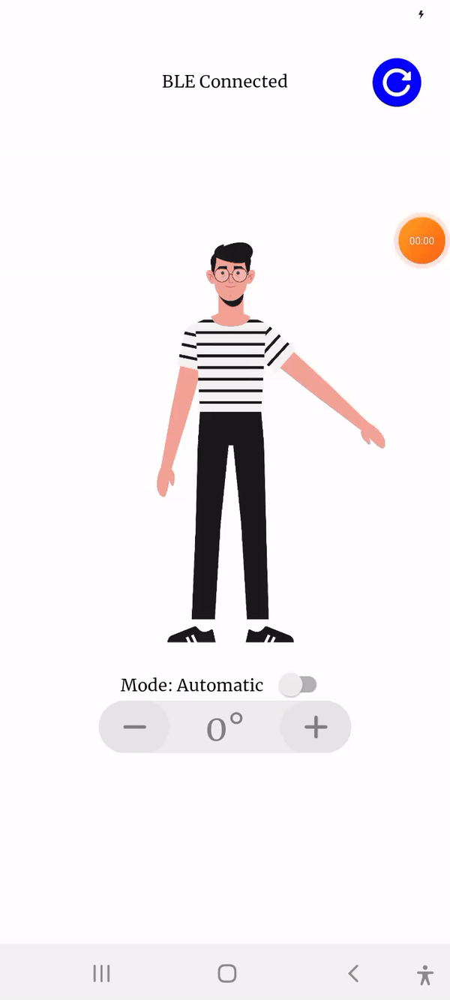

# Soft Robotics for Assistive Healthcare App

This repository contains the source code for a mobile application designed to visualize, control, and interact with the Pelops soft-exoskeleton designed for 7CCEMRGP "_Soft Robotics for Assistive Healthcare_", focusing on shoulder rehabilitation. The app connects to the exoskeleton via Bluetooth, enabling real-time communication and data monitoring.

  

## Features
- Bluetooth-based exoskeleton control
- Real-time position monitoring

## Technologies
- HTML, CSS, JavaScript
- React Native
- Expo, EAS
- Bluetooth Low Energy (BLE)
- Nimble
- ESP32

